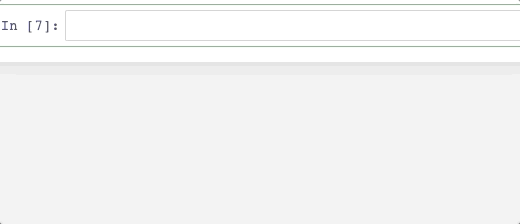

# TabNine for Jupyter Notebook

**This plugin has been tested on MacOS, Linux and Windows, it support all these systems. For browsers it supports Chrome and Safari but not IE**

If you found this plugin doesn't work for you, please debug according to [How to Debug](DEBUG.md). And if you can't figure out what's wrong, please release an issue and report the logs in detail.

Thanks for using this plugin! Have fun! :)

*Read this in other languages: [English](README.md), [中文](README.ch.md)*



This extension for Jupyter Notebook enables the use of coding auto-completion based on Deep Learning.

Other client plugins of TabNine require starting a child process for TabNine binary and using Pipe for communication. This can’t be done with Jupyter Notebook, since child process can’t be created with JQuery and Jupyter Notebook doesn’t provide any way for adding third-part js libs to plugins.

In this repository, it is achived by developing a client plugin and a server plugin for Jupyter Notebook. The client plugin generate request info and send http request to the server plugin. The server plugin pass the request info to it’s client process (TabNine) and return the request to client plugin.

## Installation

I saw a lot users came across problems due to didn't install and configure this plugin correctly, the simplest way to install and configure this plugin is by issuing following command:

```
pip3 install jupyter-tabnine --user
jupyter nbextension install --py jupyter_tabnine --user
jupyter nbextension enable --py jupyter_tabnine --user
jupyter serverextension enable --py jupyter_tabnine --user
```

If you want to install and congiure in a customized way, you can refer to following:

The extension consists of a pypi package that includes a javascript
notebook extension, along with a python jupyter server extension. Since Jupyter 4.2, pypi is the recommended way to distribute nbextensions. The extension can be installed:

* from the master version on the github repo (this will be always the most recent version)

* via pip for the version hosted on pypi

From the github repo or from Pypi,
1. install the package
    * `pip3 install https://github.com/wenmin-wu/jupyter-tabnine/archive/master.zip [--user][--upgrade]`
    * or `pip3 install jupyter-tabnine [--user][--upgrade]`
    * or clone the repo and install
    
        `git clone https://github.com/wenmin-wu/jupyter-tabnine.git`
        
        `python3 setup.py install`
2. install the notebook extension
    `jupyter nbextension install --py jupyter_tabnine [--user|--sys-prefix|--system]`

3. and enable notebook extension and server extension
    ```Bash
    jupyter nbextension enable --py jupyter_tabnine [--user|--sys-prefix|--system]
    jupyter serverextension enable --py jupyter_tabnine [--user|--sys-prefix|--system]
    ```
---
For **Jupyter versions before 4.2**, the situation after step 1 is more tricky, since the --py option isn’t available, so you will have to find the location of the source files manually as follows (instructions adapted from [@jcb91](https://github.com/jcb91)’s jupyter_highlight_selected_word). Execute

```Python
python -c "import os.path as p; from jupyter_tabnine import __file__ as f, _jupyter_nbextension_paths as n; print(p.normpath(p.join(p.dirname(f), n()[0]['src'])))"
```
Then, issue
```Bash
jupyter nbextension install <output source directory>
jupyter nbextension enable jupyter_tabnine/main
jupyter serverextension enable <output source directory>
```
where `<output source directory>` is the output of the first python command.

## Usage

* Jupyter TabNine will be active after being installed. Sometimes, you may want to show the Jupyter original complete temporally, then click `shift` + `space`.

   
* Remote auto-completion server is also supported. You may want this to speed up the completion request handing. Or maybe your company want to deploy a compeltion server cluster that services everyone. Read following to learn how to deploy remote server.

## Uninstallation
To uninstall TabNine plugin from mac/linux run the following commands:
```Bash
jupyter nbextension uninstall --py jupyter_tabnine
pip3 uninstall jupyter-tabnine
```

## Contributing

Pull requests are welcome. For major changes, please open an issue first to discuss what you would like to change.

Please make sure to update tests as appropriate.

## License

[MIT License](LICENSE)

## Remote Completion Server Deployment
It's useful to deploy a remote tabnine server if you don't want to occupy too much local resources. You can build, deploy and config a remote tabnine server according to the following steps.

**NOTE:** You need to install jupyter-tabnine with `pip3 install https://github.com/wenmin-wu/jupyter-tabnine/archive/master.zip`, because the version which fix this plugin with remote server problem haven't been relased to PyPi.
### Build Server Image
**I have uploaded an image to Docker Hub, skip this section if you prefer to use it directly.**
* Install the golang (recommended version is 1.13 - 1.14)
* Issue `go get -v github.com/wenmin-wu/jupyter-tabnine/go/cmd`
* Issue `cd $HOME/go/src/github.com/wenmin-wu/jupyter-tabnine`
* Issue `bash ./build-image.sh`
### Start Server
**Change the image name in this bash script to `wuwenmin1991/tabnine-server:1.0` if you did't build your own image**
* Simply issue `bash start-server.sh`

### Configure Under Nbextensions
* Please [install Nbextensions](https://jupyter-contrib-nbextensions.readthedocs.io/en/latest/install.html) if you haven't installed.
* Open Jupyter Notebook and go to the Nbextensions setting page, click **Jupyter TabNine**, scroll down and fill in the remote server url, e.g.

### Stop Server
* Simply issue `bash stop-server.sh`

## Stargazers over time

[](https://starchart.cc/wenmin-wu/jupyter-tabnine)
